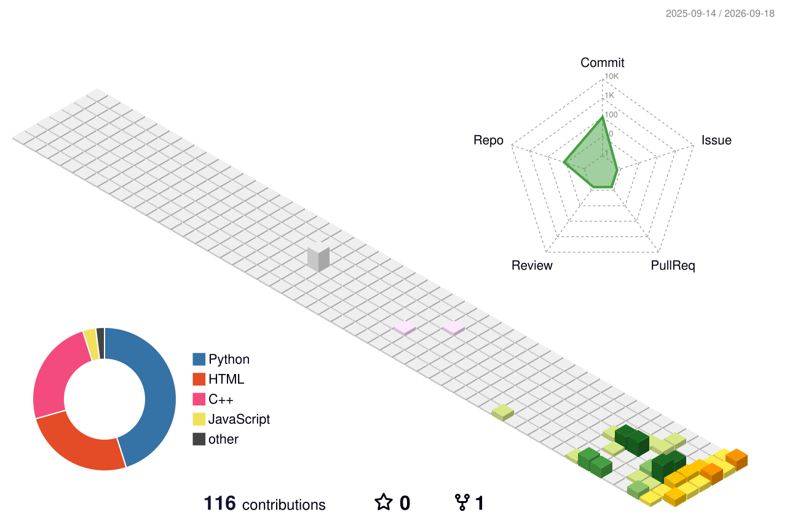

<div align="center">



<br/>

<a href="https://github.com/Mob-Imam-79">

</a>
<a href="https://linkedin.com/in/md-mobashir-imam">

</a>
<a href="mailto:mobashirimam120@gmail.com">

</a>
<a href="https://www.kaggle.com/mdmobashirimam">

</a>
<a href="https://leetcode.com/mobashir_bits120">

</a>
<a href="https://codeforces.com/profile/mdmobashirsiddique">

</a>

</div>

---

<table>
<tr>
<td width="50%" valign="top">

### `01 / ABOUT`

**Computer Science & Engineering student at National Institute of Technology, Patna.**

I build practical software around **AI/ML, Generative AI, autonomous agents, Python backends, automation, and problem solving**.

```text
┌─────────────────────────────────┐
│ CURRENT MISSION                 │
├─────────────────────────────────┤
│ AI Engineering                  │
│ Backend Development              │
│ Machine Learning                 │
│ Autonomous Agents                │
│ DSA / Competitive Programming   │
└─────────────────────────────────┘
```

</td>
<td width="50%" valign="top">



</td>
</tr>
</table>

<table>
<tr>
<td width="50%" valign="top">



</td>
<td width="50%" valign="top">

### `02 / CURRENTLY BUILDING`

**Telegram Forwarding Bot**

A Django + Telethon automation platform for multi-channel forwarding, duplicate protection, Telegram authentication, FloodWait handling, subscriptions and licensing.

### `03 / CURRENTLY LEARNING`

- Django
- Machine Learning
- Generative AI
- Autonomous AI systems
- Backend engineering

</td>
</tr>
</table>

---

## `04 / TECH STACK`

<table>
<tr>
<td align="center" width="20%"><b>LANGUAGES</b><br/><br/>
Python • C++ • C • Java • JavaScript
</td>
<td align="center" width="20%"><b>AI / ML</b><br/><br/>
PyTorch • TensorFlow • scikit-learn • NumPy • Pandas
</td>
<td align="center" width="20%"><b>WEB</b><br/><br/>
Django • React • HTML • CSS • Bootstrap • Tailwind
</td>
<td align="center" width="20%"><b>DATA</b><br/><br/>
PostgreSQL • MySQL • MongoDB • SQLite
</td>
<td align="center" width="20%"><b>TOOLS</b><br/><br/>
Git • Docker • Postman • VS Code • Blender
</td>
</tr>
</table>

<div align="center">


</div>

---

## `05 / FEATURED PROJECTS`

<table>
<tr>
<td width="33%" valign="top">

### 🤖 Autonomous AI Clinical Assistant

AI-powered healthcare assistant using **LangGraph, Gemini, Streamlit, FAISS and SQLite** for intelligent reasoning, clinical tools, medical-report analysis and patient memory.

**Focus**
- Autonomous agents
- Generative AI
- Healthcare AI
- RAG / vector search

<a href="https://github.com/Mob-Imam-79/Autonomous-AI-Clinical-Assistant">↗ Repository</a>

</td>

<td width="33%" valign="top">

### 📡 Telegram Forwarding Bot

Automation platform built around **Django + Telethon** with multi-channel forwarding, duplicate protection and FloodWait handling.

**Focus**
- Python
- Telegram API
- Automation
- Backend systems

<a href="https://github.com/Mob-Imam-79/telegram-forwarding-bot">↗ Repository</a>

</td>

<td width="33%" valign="top">

### ⚔️ Competitive Programming

A structured collection of solutions and learning work across **C++ / DSA / algorithms**.

**Focus**
- Data Structures
- Algorithms
- Codeforces
- Problem solving

<a href="https://github.com/Mob-Imam-79/competitive-programming-">↗ Repository</a>

</td>
</tr>

<tr>
<td width="33%" valign="top">

### 🍽️ Mess Food Rating Dashboard

Java-based project for working with a mess-food rating/dashboard workflow.

**Focus**
- Java
- Application development
- Data handling

<a href="https://github.com/Mob-Imam-79/Mess-Food-Rating-Dashboard">↗ Repository</a>

</td>

<td width="33%" valign="top">

### 🧠 AI Mini Project

A compact AI-focused project exploring practical application development.

**Focus**
- AI
- JavaScript
- Experimentation

<a href="https://github.com/Mob-Imam-79/AI-Mini-Project">↗ Repository</a>

</td>

<td width="33%" valign="top">

### 🥁 Drum Kit

Interactive browser-based drum kit built with JavaScript.

**Focus**
- JavaScript
- DOM
- Browser interaction
- Frontend fundamentals

<a href="https://github.com/Mob-Imam-79/Drum-Kit">↗ Repository</a>

</td>
</tr>
</table>

---

## `06 / GITHUB SYSTEM STATUS`

<div align="center">





</div>

<div align="center">


</div>

---

## `07 / CONTRIBUTION GRID`

<div align="center">


</div>

---

## `08 / 3D CONTRIBUTION LANDSCAPE`

<div align="center">



</div>

---

## `09 / ENGINEERING FOCUS`

<table>
<tr>
<td width="25%" align="center">

**AI / ML**

Machine Learning  
Deep Learning  
Generative AI  
LLM Applications

</td>
<td width="25%" align="center">

**AGENTS**

LangGraph  
Tool Calling  
Memory  
Autonomous Workflows

</td>
<td width="25%" align="center">

**BACKEND**

Python  
Django  
REST APIs  
Databases

</td>
<td width="25%" align="center">

**PROBLEM SOLVING**

C++  
DSA  
Algorithms  
Competitive Programming

</td>
</tr>
</table>

<div align="center">



</div>

---

## `10 / ACHIEVEMENT`

<div align="center">

### JEE Main 2024 — 99.07 Percentile

**Computer Science & Engineering • National Institute of Technology, Patna**

</div>

---

## `11 / CONNECT`

<div align="center">

<a href="mailto:mobashirimam120@gmail.com">

</a>
<a href="https://linkedin.com/in/md-mobashir-imam">

</a>
<a href="https://github.com/Mob-Imam-79">

</a>

<br/><br/>



</div>
